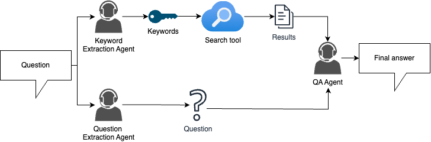

一个初步使用RAG AI Agent的小作用

作业中写了份小工具用于上网搜索资料(被我替换成了使用DeepSeek API，因为网络的问题)，然后将资料发给AI Agent进行资料总结; 

将总结的资料 + 问题 最终发送给回答问题的AI Agent，此时可以让AI Agent回答出其本身不具备的知识， 大体思路如下：

* [作业代码网站](https://colab.research.google.com/drive/1OGEOSy-Acv-EwuRt3uYOvDM6wKBfSElD?usp=sharing)
