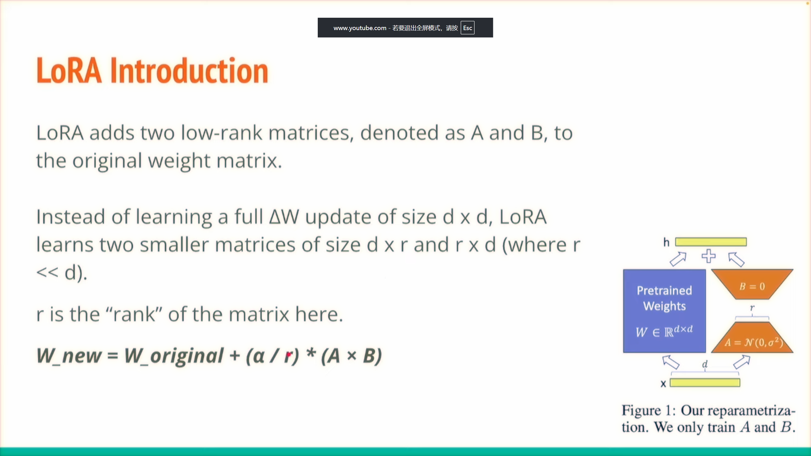
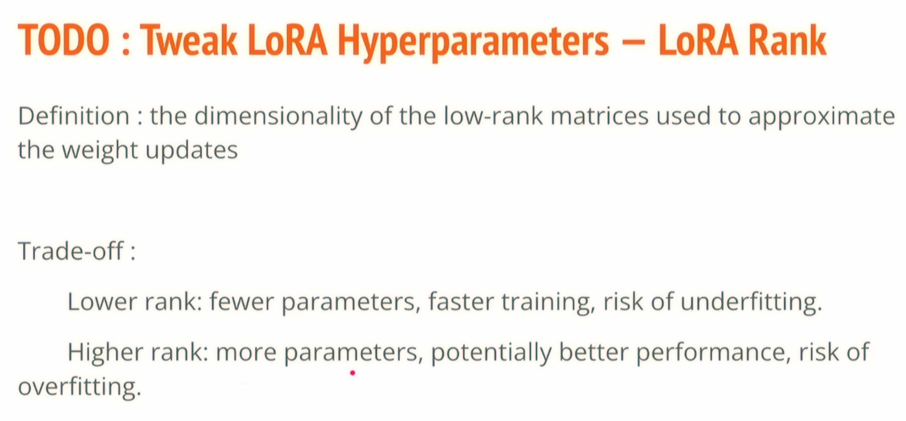
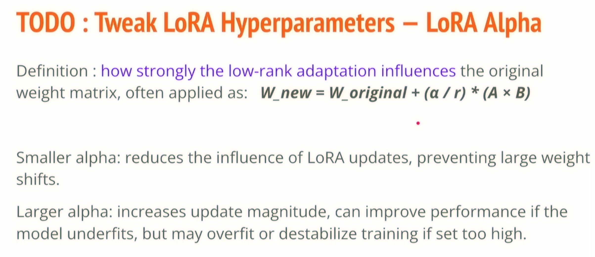
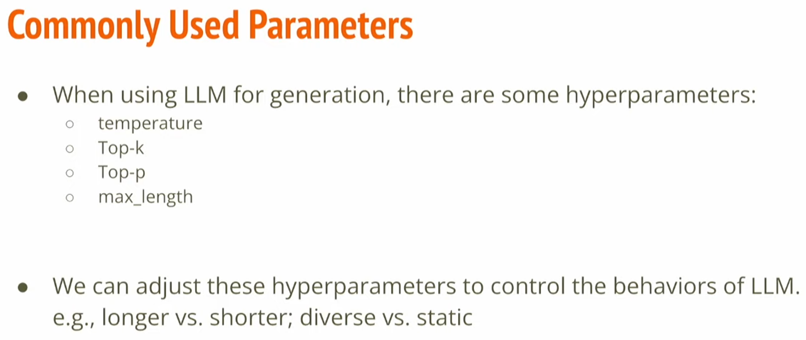

Fine tune is powerful
* [PPT](https://speech.ee.ntu.edu.tw/~hylee/ml/ml2025-course-data//hw5.pdf)

# 微调原理

## 参数1 rank(r)

## 参数2 阿尔法(α)

## decoding参数

## 筛选出高质量微调数据

# 作业后的感悟

基于unsloth平台进行微调。

**微调并没有让模型学习到新东西，只是激发模型本身的知识潜力，让模型按照我们需要的模板进行回答(即让按照我们模板回答的概率更大点)。**

因为大模型是token by token地输出，让前一个token没有回答好，非常可能滚雪球式地让接下来的token都回答不好。微调就是让大模型按照既定的模板进行回答，可以说是引导大模型如何回答问题

这里所谓的模板也是作业中困扰我最久的地方，其实模板就是将原本的数据拼接到**一个问答框架中**，例如：

其中我们只要将数据填进到{INPUT}, {OUTPUT}中就得到我们最终要喂给模型的输入数据text；通过此微调的模型会对此模板的回答方式非常熟悉，当我们输入文本是这种模板的类型时，模型就会按照我们想要的效果回答出结果。具体可以看看我在"MLHW5/mlhw5_chat_template.ipynb"写的代码和输出。

* [unsolth 官方教程](https://unsloth.ai/docs/get-started/fine-tuning-llms-guide/tutorial-how-to-finetune-llama-3-and-use-in-ollama#id-9.-customizable-chat-templates)
* [作业官网代码](https://colab.research.google.com/drive/1XTLX9o2QveOs71-njzw2ZLNcz7RIDhyX?usp=sharing#scrollTo=JR7YHn1AZLbO)
* [unsolth 官方微调指南](https://unsloth.ai/docs/get-started/fine-tuning-llms-guide/lora-hyperparameters-guide)